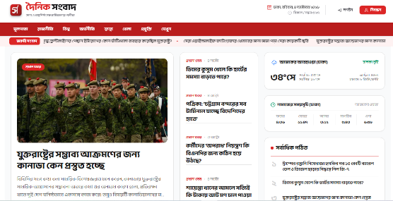

# Dainik Sangbad (দৈনিক সংবাদ)[cite: 7]

Dainik Sangbad is a modern, fast, and fully responsive Bengali online news portal application built with Next.js (App Router) and Tailwind CSS[cite: 7]. Designed to deliver authentic, objective, and timely news, the platform features clean typography, live weather, real-time prayer timings, category filtering, and an optimized reading experience across all devices[cite: 7].

## Overview[cite: 7]

This platform provides readers with a seamless digital journalism experience[cite: 7]. Beyond standard headlines, highlights, and categorized feeds, it incorporates dynamic features like live weather telemetry and prayer schedules[cite: 7]. The application automatically filters out third-party social media promotional elements to maintain editorial integrity and readability[cite: 7].

## Features[cite: 7]

* **Modern Editorial Layout:** Well-structured homepage featuring top highlights, leading stories, and categorized news grids[cite: 7].
* **Dynamic Article Pages:** Rich article details with high-resolution imagery, photo credits, publication timestamps, and interactive topic tags[cite: 7].
* **Content Filtering:** Advanced filtering algorithms to strip away non-news items, promotional banners, and social channel invites[cite: 7].
* **Live Weather Integration:** Real-time temperature, highs, lows, humidity, and wind speed updates for Dhaka[cite: 7].
* **Dynamic Prayer Schedules:** Automatically updated daily prayer (Salah) times formatted in Bengali digits[cite: 7].
* **Most Read Showcase:** Ranked list of trending stories rendered with localized Bengali numbering[cite: 7].
* **Category Archives & Pagination:** Dedicated category routes (Technology, National, Politics, etc.) with pagination controls[cite: 7].
* **Comprehensive SEO & Meta:** Server-rendered OpenGraph cards, canonical tags, dynamic meta titles, and structured JSON-LD schemas[cite: 7].
* **Skeleton Loading & Error Boundaries:** Smooth skeleton fallbacks and defensive API handling preventing UI crashes on upstream outages[cite: 7].
* **Adaptive Theme & Responsive Design:** Tokenized styling using CSS variables (`--primary`), custom-crafted news cards, and mobile-friendly typography[cite: 7].

## Tech Stack[cite: 7]

* **Framework:** Next.js (App Router)[cite: 7]
* **Language:** TypeScript / JavaScript[cite: 7]
* **Styling:** Tailwind CSS[cite: 7]
* **Icons:** React Icons (Feather Icons, Weather Icons, FontAwesome)[cite: 7]
* **Deployment:** Vercel[cite: 7]

---

* **Github Repo:** https://github.com/mrrakib5007/dainik-sangbad[cite: 7]
* **Live Preview:** https://dainik-sangbad.vercel.app[cite: 7]